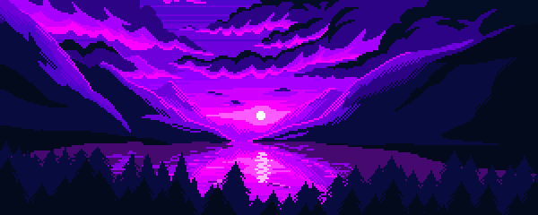

<h1 align="center">Lucas Canella N.S.</h1> 
<h3>Anything</h3>

<b>
Lorem ipsum dolor sit amet, consectetur adipisicing elit, sed do eiusmod tempor incididunt ut labore et dolore magna aliqua. Ut enim ad minim veniam, quis nostrud exercitation ullamco laboris nisi ut aliquip ex ea commodo consequat. Duis aute irure dolor in reprehenderit in voluptate velit esse cillum dolore eu fugiat nulla pariatur. Excepteur sint occaecat cupidatat non proident, sunt in culpa qui officia deserunt mollit anim id est laborum.
</b>

<h3>My GitHub stats</h3>

&nbsp;

<h3 align="left">My skills include</h3>

<h3 align="left">What I am currently learning</h3>

<h3 align="left">What I am interested in learning</h3>

<h3 align="left">Where to find me</h3>

  

